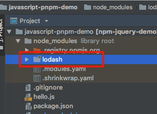

JavaScript "pnpm" Demo
======================

"pnpm"是一个与npm相似的包管理器，不同点在于它更注重磁盘空间，可以保证如果在不同的项目中使用了某个依赖库的同一个版本，那么该依赖在磁盘上只存在一份真正的copy，大大节省磁盘空间。

由于"pnpm"直接使用npm的`package.json`中的定义，所以它只能以全局方式安装：

```
npm install -g pnpm
```

然后：

```
pnpm install
```

You will see:

```
Resolving: total 1, reused 1, downloaded 0, done

dependencies:
+ lodash 4.17.10

```

可以看到`reused 1, downloaded 0`说明`package.json`中声明的`lodash 4.17.10`在本地磁盘中已经存在，不需要重新下载。

它到底是怎么减少磁盘占用的呢？
---------------

打开`node_modules`，也可以看到`lodash`是一个引用：



它指向了`./node_modules`下的另一个目录：

```
$ ls -l
... lodash -> .registry.npmjs.org/lodash/4.17.10/node_modules/lodash
```

奇怪，`pnpm`不是说每个版本的依赖只有一个copy吗？
那为什么指向的是`node_modules`下的一个目录而不是全局cache？

带着这个疑问，我研究了[“硬连接”](https://github.com/freewind-demos/os-disk-file-hard-soft-link-demo)的概念，发现这个目录虽然是在当前项目下，但是里面所有的文件都是对全局cache下lodash的硬连接。

```
$ ls -i ./node_modules/.registry.npmjs.org/lodash/4.17.10/node_modules/lodash/index.js
20766241 ./node_modules/.registry.npmjs.org/lodash/4.17.10/node_modules/lodash/index.js
```

```
$ ls -i /Users/freewind/.pnpm-store/2/registry.npmjs.org/lodash/4.17.10/node_modules/lodash/index.js
20766241 /Users/freewind/.pnpm-store/2/registry.npmjs.org/lodash/4.17.10/node_modules/lodash/index.js
```

可以看出，当前项目下的lodash中的`index.js`文件与全局cache下的相应文件的inode是完全一样的，这就证明了当前目录下的lodash的确是硬连接，并不占用额外的空间。
